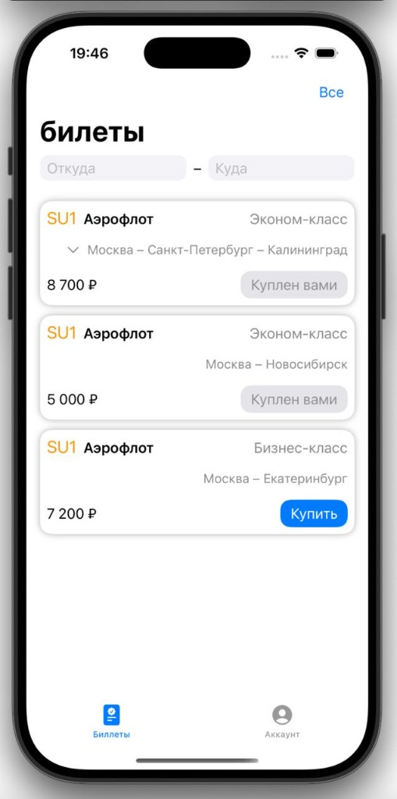
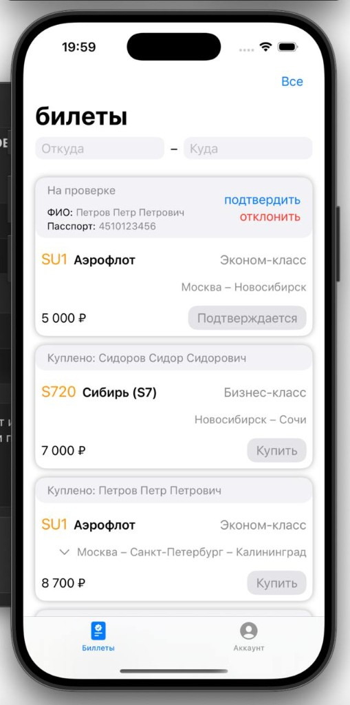
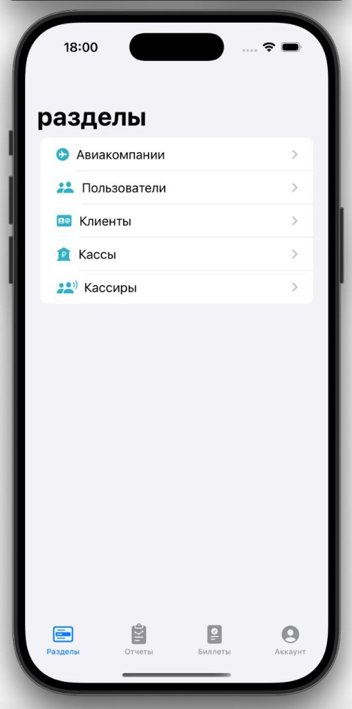
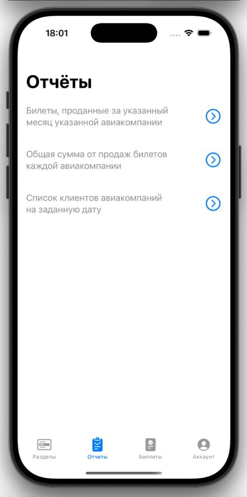
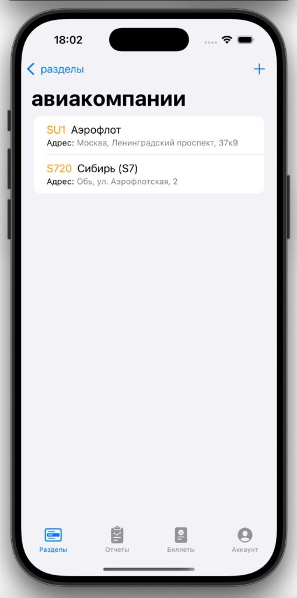

# AirlinesApp

Учебный iOS-клиент для учёта авиабилетов и работы авиакасс: компании, кассиры, клиенты, продажа билетов и отчёты.

Парный бэкенд: [`airlines_api`](https://github.com/DucksNotDead/airlines_api).

## Скриншоты

<p align="center">
  
  
  
</p>
<p align="center">
  
  
</p>

## Возможности

- Авторизация и профиль пользователя
- Реестры: авиакомпании, кассы, кассиры, клиенты, пользователи
- Продажа и учёт билетов (покупка, статусы, модерация)
- Фильтрация билетов по маршруту (откуда / куда)
- Отчёты (в т.ч. с выгрузкой в PDF):
  - билеты, проданные за месяц указанной авиакомпанией
  - общая сумма продаж по авиакомпаниям
  - список клиентов авиакомпаний на заданную дату

## Стек

- Swift / SwiftUI
- MVVM
- REST API

## Запуск

1. Откройте `AirlinesApp.xcodeproj` в Xcode.
2. Укажите хост API в `AirlinesApp/Services/ApiService.swift`:

```swift
enum Hosts: String {
    case local = "localhost" // симулятор
    case home = "192.168.0.101"
}

let HOST: Hosts = .local
```

3. Убедитесь, что [`airlines_api`](https://github.com/DucksNotDead/airlines_api) запущен и доступен.
4. Соберите и запустите приложение на симуляторе или устройстве.
